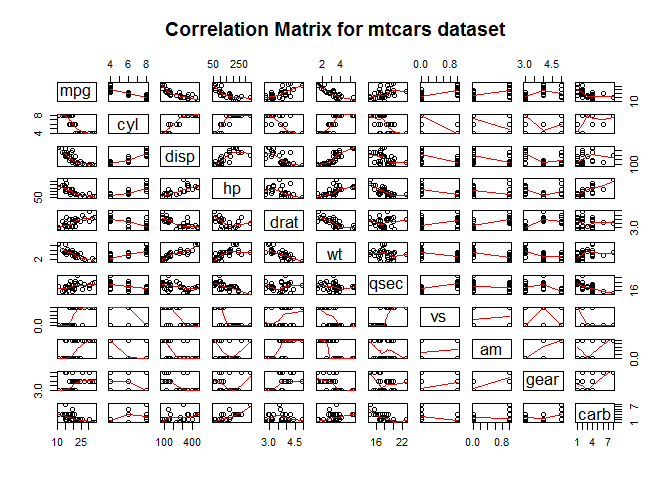
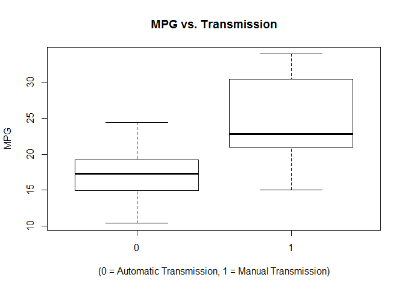
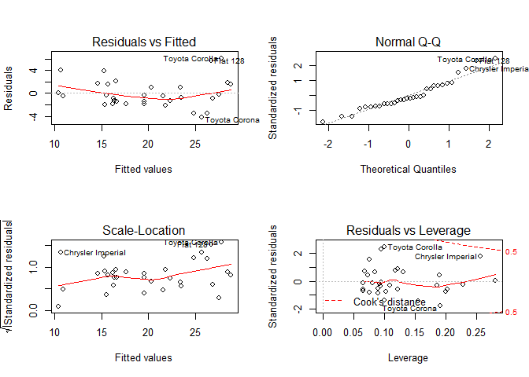

# Effect of transmission on mpg in motor cars
Sharath G  
Sunday, February 22, 2015  


###Executive Summary###
In this project, we analyze the mtcars data set to answer the following questions:
1. Is an automatic or manual transmission better for MPG?
2. Quantify the MPG difference between automatic and manual transmissions?

Based on our analysis, we find that weight of a motor vehicle is the primary driver of its fuel efficiency. Transmission has very little impact on Miles Per Gallon and therefore having automatic or manual transmission does not directly impact Miles Per Gallon. Transmission effects weight which in turn effects mileage. 


###Exploratory Analysis###
First, we plot a scatterplot matrix. We observe that all variables except qsec, gear and carb are related to mpg. 


```r
pairs(mtcars, panel=panel.smooth, main="Correlation Matrix for mtcars dataset")
```

Next, plotting mpg versus transmission indicates that cars with manual transmission have higher mpg than cars with automatic transmission.  


```r
boxplot(mpg ~ am, data = mtcars, xlab = " (0 = Automatic Transmission, 1 = Manual Transmission) ", ylab = "MPG", main = "MPG vs. Transmission")
```

We arrive at the conclusion through statistical inference after comparing mpg means for automatic and manual cars. We see that the difference between the means ranges from -11.3 to -3.2 and does not include 0. Therefore the difference in mpg between the automatic and manual transmission is statistically significant. We are however not sure if this couldbe due to a confounding variable that has not been controlled for.


```r
t.test(mpg ~ am, data = mtcars)
```


###Regression Model###

First, we plot a regression model that includes all variables. This helps us understand which predictor variables have a strong effect on outcome variables. 


```r
model_all <- lm(mpg ~., data = mtcars)
summary(model_all)
```

This model has a residual standard error 2.65, a R-squared of 0.869 and Adjusted R-squared of 0.8066. Wt is the only predictor variable that is significant and we include that in the final model. We also include 'am' in the model to study the relationship between 'am' and 'mpg'. We try the fowlling models and observe R-squared and standard error for the models to find the best model. 


```r
model_1 <- lm(mpg ~ wt, data = mtcars)
model_2 <- lm(mpg ~ wt + am,  data = mtcars)
model_3 <- lm(mpg ~ wt + am + cyl,  data = mtcars)
model_4 <- lm(mpg ~ wt + am + hp,  data = mtcars)
```

Looking at these models we make the following conclusions:
1. Based on model2, we conclude that 'am' does very little to explain the variance in 'mpg'. This means that 'am' has very little impact on 'mpg'.  
2. Even the other variables, cyl annd hp do not increase R-squared or decrease standard error. 
3. We see that adding variables does not improve R-squared and we take a parsimonious approach and finalize model_2 as our final model. Infact, even 'am' has a marginal effect in improving R-squared and most of the variance is explained by wt in model2. 

###Residual and Diagnostics Analysis###

```r
par(mfrow = c(2, 2))
plot(model_2)
```
Analyzing the Residuals Vs. Fitted, Normal Q-Q, Scale_location plots we can conclude that the model does not violate any of the regression assumptions. Since, we do not see any outliers in the Residuals Vs Leverage plot, we do not dig deeper into isolating infleuncers or outliers. 


###Prediction###

```r
model_2 <- lm(mpg ~ wt + am,  data = mtcars)
new_data_am = data.frame(wt = mean(mtcars$wt), am=0)
p_am <- predict(model_2, newdata = new_data_am, level=0.95, interval="confidence")
new_data_manual = data.frame(wt = mean(mtcars$wt), am=1)
p_manual <- predict(model_2, newdata = new_data_manual, level=0.95, interval="confidence")
```

The predicted mpg value for automatic transmission at mean weight is 20.1002187 and the lower and upper limit is 18.3961668 and 21.8042706 respectively. The corresponding mean value for manual transmission is 20.0766035and the lower and upper limit is 17.8908508 and 22.2623561 respectively. Looking at the predicted values, we conclude that the transmission has a minor effect on mpg. wt is the confounding factor. 'am' just seems to effect 'mpg' but it is really 'wt' that affects 'mpg'. Vehicles with automatic transmission are heavier than vehicles with manual transmission. This effect makes it appear that the transmission type impacts mpg. 

###Appendix###

Exploratory Analysis

```r
pairs(mtcars, panel=panel.smooth, main="Correlation Matrix for mtcars dataset")
```

 

```r
boxplot(mpg ~ am, data = mtcars, xlab = " (0 = Automatic Transmission, 1 = Manual Transmission) ", ylab = "MPG", main = "MPG vs. Transmission")
```

 


Statistical Inference

```r
t.test(mpg ~ am, data = mtcars)
```

```
## 
## 	Welch Two Sample t-test
## 
## data:  mpg by am
## t = -3.7671, df = 18.332, p-value = 0.001374
## alternative hypothesis: true difference in means is not equal to 0
## 95 percent confidence interval:
##  -11.280194  -3.209684
## sample estimates:
## mean in group 0 mean in group 1 
##        17.14737        24.39231
```

Residuals and Diagnostic Plots

```r
par(mfrow = c(2, 2))
plot(model_3)
```

 


